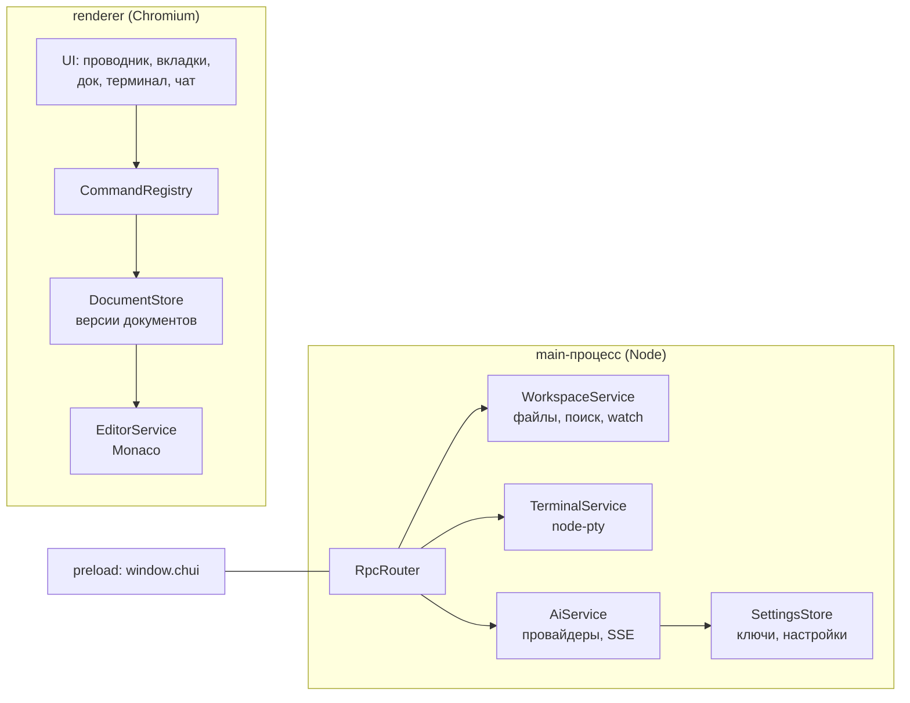

# Chui IDE

IDE на Electron и чистом TypeScript: раскладка в духе PyCharm New UI («острова» со скруглёнными
панелями), собственная светлая и тёмная палитра, подсветка кода цветами VS Code,
настоящий терминал на PTY, документная модель, реестр команд и готовый канал для AI-ассистента.

Смысл проекта — заложить то, что потом дорого переделывать: единый реестр команд,
версионируемый документ, RPC со стримингом и абстракция файловой системы. Ассистент
надстраивается сверху, а не врезается в середину.



## Быстрый старт

```bash
npm install
npm run rebuild        # пересобрать node-pty под ABI Electron (обязательно один раз)
npm run dev            # Vite + Electron, HMR для renderer
npm run build && npm start
```

Проверки без запуска приложения целиком:

```bash
npm run smoke:pty        # node-pty в контексте Electron
npm run smoke:terminal   # TerminalService: сессия, ввод, вывод, resize, kill
npm run smoke:window     # арифметика своей рамки: перенос, растягивание, зажим по минимуму
npm run smoke:git        # GitService на временном репозитории: статус, индекс, коммит, diff, ветки
npm run smoke:launcher   # стартовое окно и переход в IDE: два окна, настоящий IPC
```

Когда проверка должна заглянуть внутрь настоящего окна IDE, берём «пробники» — они не
оценивают, а печатают состояние:

```bash
./node_modules/.bin/electron scripts/ide-probe.cjs     # открывается ли окно и что в дереве
./node_modules/.bin/electron scripts/fs-probe.cjs      # создание файла и папки, «Обновить», меню редактора
```

«Пробники» возвращают видимые значения вместо `ok`/`FAIL`, потому что у окна IDE есть
подводный камень: `executeJavaScript` до `did-finish-load` копится в очереди, а частые
запросы друг за другом держат поток занятым — окно начинает считаться «не отвечающим».
Поэтому один запрос за раз и с запасом по времени.

Интерфейс можно посмотреть и в обычном браузере — без Electron и его окон: `scripts/ui-mock.js`
подставляется до загрузки страницы и отвечает на те же RPC-вызовы, но данными из памяти
(`page.addInitScript({ path: 'scripts/ui-mock.js' })` против работающего `npx vite`).
Это дешевле скриншотов и не поднимает второе окно.

Мок обязан повторять то же поведение, что и main: дерево он рисует по своим папкам,
а содержимое файлов держит отдельно, поэтому создание, переименование и удаление
правят оба списка. Иначе файл создаётся и открывается в редакторе, но в дереве не
появляется — проверка покажет несовершенство мока, а не ошибку интерфейса.

Требуется Node ≥ 20. Проверено на Electron 44, Vite 8, TypeScript 7, Monaco 0.57, node-pty 1.1.

### Про нативный модуль

`node-pty` собирается под ABI обычного Node, а в Electron с таким бинарником падает с SIGSEGV.
Поэтому после установки нужен `npm run rebuild` (`@electron/rebuild`). Проверить результат:

```bash
npm run smoke:pty        # node-pty в контексте Electron
npm run smoke:terminal   # TerminalService целиком: сессия, ввод, вывод, resize, kill
```

## Что уже работает

**Старт приложения**

- Приложение открывается стартовым окном (`src/renderer/welcome.html`): кнопки «Открыть проект»
  и «Склонировать проект», список недавних проектов, а если история пуста — заглушка.
- Окно IDE создаётся после выбора: main открывает папку, запоминает её в `settings.json`
  (`workspace.recent`) и создаёт окно редактора. Стартовое окно закрывает сам лаунчер — уже
  получив ответ на `app.openProject`: если закрыть его в main, ответ отправлять будет некуда,
  и вызов в renderer не разрешится никогда. Окно IDE забирает уже открытый корень
  (`workspace.current`), поэтому папку не приходится выбирать дважды.
- Клонирование идёт через `git clone --progress` в выбранную папку, строки прогресса приходят
  в стартовое окно событиями вызова. Папку для клона пользователь выбирает сам, имя берётся из адреса.
- У стартового окна отдельная точка входа и своя сборка: Monaco и xterm в него не попадают.

**Интерфейс**

- Своя рамка окна: системной шапки нет — есть наша (меню приложения, виджет проекта,
  заголовок, действия и кнопки окна), перетаскивание за шапку и растягивание за края.
- Раскладка в стиле PyCharm New UI: фон приложения темнее панелей, панели — «острова»
  со скруглёнными углами, зазоры между ними работают сплиттерами.
- Светлая и тёмная схемы (плюс «как в системе») — палитра устроена по ролям: поверхности,
  текст, линии, акценты. Переключается кнопкой в шапке, из меню «Вид» или палитры команд.
- Подсветка кода — цвета VS Code: Dark+ в тёмной схеме, Light+ в светлой.
- Слева больше нет полосы иконок: все переключатели живут в шапке — боковая панель
  рядом с виджетом проекта, поиск, терминал, AI, палитра и настройки справа.
- Сверху — панель с виджетом проекта и быстрыми действиями.
- Редактор: вкладки с синей полосой у активной, хлебные крошки под ними.
- Снизу — док с вкладками «Поиск» и «Терминал», справа — «остров» AI Assistant.
- Статусбар как в PyCharm: путь к файлу, `строка:столбец`, `LF`, `UTF-8`, отступ, язык.

**Git**

- Ветка и число файлов с правками — в статусбаре; клик открывает панель изменений.
- Панель «Изменения» в нижнем доке (`Ctrl+Shift+G`): поле сообщения коммита, два списка —
  проиндексированные и остальные правки, у каждой строки кнопка индексации.
- Файлы помечены буквами и цветом и в дереве проекта, и в списке изменений: `M`, `A`, `D`,
  `R`, `U` (новый), `!` (конфликт).
- Сравнение версий — отдельный экран поверх редактора (`Escape` закрывает): `staged` сравнивается
  с `HEAD`, остальное — с индексом. Открывается кликом по строке изменения.
- Переключение ветки — списком в панели; откат правок и коммит с пустым индексом
  спрашивают подтверждение системным диалогом.
- Всё через обычный `git` в main-процессе: чужие алиасы, хуки и настройки подписи работают как у вас,
  а renderer о репозитории знает только по снимку статуса и push-событиям `git:changed`.

**Редактор и проект**
- Проводник с ленивой загрузкой, инлайн-созданием и переименованием, контекстным меню.
- Пометки git: буква у файла и точка у папки, внутри которой есть правки (в свёрнутом дереве
  иначе не видно, что в папке что-то меняли); в подсказке — сколько правок внутри.
- Создание файлов и папок, переименование, удаление в корзину (`shell.trashItem`).
  Имя вводится в дереве; создание в корне проекта тоже показывает поле — строка самого
  корня в дереве не рисуется, поэтому для неё есть отдельная ветка отрисовки.
- «Обновить» перечитывает папки, не схлопывая дерево: раскрытые папки и выделение
  остаются на месте (сброс происходит только при смене проекта).
- Пока открыто поле ввода имени, дерево не перерисовывается: перерисовка уносит
  поле из документа, а его `blur` закрывает ввод — со стороны это выглядело так,
  будто кнопка «Новый файл» ничего не делает.
- Поиск по проекту: регулярки, glob-маска, переход к совпадению.
- Monaco с подсветкой и TS/JSON/CSS/HTML-сервисами в web worker'ах, тема под Darcula.
- Интерфейс редактора на русском: контекстное меню, палитра `F1`, поиск и подсказки — строки
  из пакета переводов Microsoft (см. «Локализация редактора»).
- Автообновление дерева при изменении файлов на диске (`fs.watch` с debounce).

**Терминал**

- Настоящий PTY (`node-pty`) в main-процессе, отрисовка `xterm.js` в renderer.
- Несколько сессий с вкладками, свой рабочий каталог, `resize` при изменении панели,
  завершение процесса, очистка экрана.
- Вывод склеивается в main по 8 мс, чтобы не топить IPC мелкими чанками.

**AI**

- Провайдеры OpenAI-совместимого API: OpenAI, Groq, Ollama, llama.cpp, LM Studio.
- Стриминг ответа, остановка генерации, выбор модели, ключ хранится только в main.
- Палитра команд (`Ctrl+Shift+P`), меню приложения, горячие клавиши, уведомления.

## Своя рамка окна

Окно создаётся без системных украшений (`frame: false`) — рамку рисует renderer.
На macOS вместо этого `titleBarStyle: 'hiddenInset'`: там остаются системные «светофоры»,
а свои кнопки скрываются (иначе окно теряет привычное управление).

| Что обычно делает оконный менеджер | Кто делает здесь |
|---|---|
| перетаскивание за шапку | CSS `app-region: drag` на шапке (жест ведёт Chromium через WM) |
| кнопки свернуть/развернуть/закрыть | `core/window-frame.ts` → RPC `window.*` |
| растягивание за края | невидимые полосы по краям окна → `window.setBounds` с зажимом по минимуму в main |
| полоса меню | кнопка «☰» в шапке открывает то же меню приложения (`app.showMenu`) |
| состояние «развёрнуто» | push-событие `window:state`: кнопка меняет иконку, края прячутся |

Горячие клавиши меню продолжают работать: `Menu.setApplicationMenu` регистрирует их
и у безрамочного окна — просто сама полоса не отображается.

Обе страницы (`index.html` и `welcome.html`) создают `WindowFrame` и вызывают
`refresh()`: без него окно не узнаёт про свою рамку — не встаёт класс
`has-custom-frame`, не приходят заголовки кнопок и прячутся края.

Значки кнопок берутся у системы: на Linux (Plasma рисует шевроны) — `⌄` свернуть,
`⌃` развернуть, двойной шеврон вверх — восстановить; на остальных платформах
привычные `− □ ✕`. На macOS кнопок нет вовсе — там системные «светофоры».

## Шрифты

Оба семейства лежат в проекте, а не берутся из системы: интерфейс — Inter,
код и терминал — JetBrains Mono. Файлы — переменные (variable), поэтому на всё
приложение их четыре: `InterVariable.ttf`, `InterVariable-Italic.ttf`,
`JetBrainsMonoVariable.ttf`, `JetBrainsMonoVariable-Italic.ttf`
(`src/renderer/assets/fonts/`). Один файл закрывает весь диапазон начертаний
(Inter 100–900, JetBrains Mono 100–800), поэтому вместо десятков начертаний — четыре файла,
а вес выбирается точно, без подмены ближайшим.

Подключение — `src/renderer/styles/fonts.css` (`@font-face`), он импортируется
в обеих точках входа (`main.ts`, `welcome.ts`) до темы. Имена семейств — ровно те,
что уже просит код: `--font_ui` в `theme.css` начинается с `'Inter'`, `--font_mono`,
`editor-service.ts` и `ui/terminal.ts` — с `'JetBrains Mono'`; дальше везде системные
запасные варианты, поэтому sans-serif и monospace остаются в стеке как страховка.
Лицензия у обоих — SIL Open Font License 1.1, тексты лежат рядом с файлами.

Два места измеряют метрики шрифта до того, как файл загрузится, и их приходится
пересчитывать: Monaco — `document.fonts.load()` плюс `monaco.editor.remeasureFonts()`,
xterm — `fit.fit()` с `refresh()` (иначе ширина символа и сетка терминала посчитаны
по запасному шрифту). Интерфейсу это не нужно: `font-display: swap` меняет шрифт
сразу после загрузки локального файла.

## Локализация редактора

Строки Monaco — контекстное меню, палитра `F1`, поиск, подсказки, метки доступности —
библиотека берёт из таблицы `globalThis._VSCODE_NLS_MESSAGES`, а переводы Microsoft
кладет в сам пакет: `monaco-editor/nls/lang/<язык>.js` (в 0.57 это 2138 строк для русского).
Русский поэтому включается одним импортом в `src/renderer/main.ts`:

```ts
import 'monaco-editor/nls/lang/ru.js';   // обязательно до `./app`
```

Порядок важен: подписи действий читаются при загрузке модулей Monaco, а не при первом
показе меню. В стартовом окне импорта нет — Monaco туда вообще не попадает.

Что остается английским: диагностики TypeScript из web worker'а — публичного способа
передать ему локализованные сообщения у Monaco нет (`setLocalizedDiagnosticMessages`
есть только внутри `typescriptServices.js`). Формулировки перевода — из VS Code, местами
спорные («Копирование» вместо «Копировать»); переопределять их по индексам таблицы не стоит,
надёжнее дать свою подпись своему действию.

## Оформление попапов редактора

Меню по правой кнопке, палитра `F1`, поиск, подсказки и окно параметров рисует Monaco,
и по умолчанию они выглядят как VS Code, а не как наше приложение. Приведены к общей
системе в три слоя:

- **Цвета** — `core/theme.ts`. Задано больше сотни идентификаторов Monaco: сам редактор,
  а также попапы (`menu.*`, `quickInput*`, `list.*`, `input.*`), поиск (`editor.findMatch*`),
  диагностика (`editorError/Warning/Info`) и экран сравнения (`diffEditor*`, цвета из `--git_*`).
  Заливка «это текущее» одна и та же, что у дерева и вкладок: `--selection_background`
  в непрозрачном виде (`#154162` в тёмной схеме, `#dbeeff` в светлой).
- **Переменные `--vscode-*` и палитра команд** — `styles/monaco.css`. Библиотека читает эти
  переменные в своих правилах (в VS Code их объявляет сама оболочка), поэтому радиус, тень,
  толщина рамки и ступени текста попапов задаются нашими токенами. Здесь же — попапы,
  которые Monaco рисует в обычном DOM редактора (`quick-input-widget`, `find-widget`,
  `suggest-widget`, `monaco-hover`, `parameter-hints-widget`): палитра `F1` и прочие быстрые
  вводы приведены к нашему `.palette` — плотная поверхность карточки, радиус 12 px, модальная тень,
  шрифт Inter, заголовок с полем без рамки, отступ строк 6 px с радиусом 8 px,
  сочетания клавиш как `.palette-item-key` (рамка, JetBrains Mono, 10.5 px), анимация `popup-in`.
  Цвета этих попапов Monaco рисует inline-стилями из темы, поэтому в `monaco.css` они
  перекрываются `!important`.

  Чего сделать нельзя: высоту строки списка в палитре. Список виртуализированный,
  шаг строк (22 px) считается в JS — правка CSS-высоты приводит к наезду строк друг на друга,
  проверено. Чтобы не было двух разных палитр, `F1` внутри редактора перенаправлен
  на нашу палитру (`Ctrl+Shift+P`): `editor-service.ts` → `monaco.editor.addCommand`
  плюс динамическая привязка `addKeybindingRule`, она перекрывает встроенную
  `editor.action.quickCommand`.
- **Материал меню** — `core/monaco-chrome.ts`. Меню по правой кнопке живёт в shadow root
  (`div.shadow-root-host` → `.monaco-menu`), куда правила страницы не заходят: модуль
  дописывает один небольшой стиль внутрь корня и следит за DOM, потому что корни создаются
  лениво (их же создаёт и экран сравнения).
  Там же меню приведено к нашим попапам: отступ контейнера 4 px, пункт `5px 9px` с радиусом 8 px
  и зазором 12 px, высота строки из токена `--line_height_ui`, сочетание клавиш 11 px
  в третьей ступени текста, разделитель 1 px с отступами `4px 6px` — всё как у `.context-item`
  и `.select-item`. Свои правила Monaco вставляет в корень позже нашего стиля, поэтому
  перекрываем их удвоенным селектором (так же делает и сам Monaco в правилах повышенного
  контраста), а где у Monaco стоит `!important` — там и у нас он есть.

Три ловушки, на которые стоит смотреть при обновлении Monaco:

- `--vscode-menu-border` обязателен: в правиле меню он используется как единственный цвет,
  а в подстановке стоит имя цвета (`editorWidget.border`), и без переменной вся декларация
  `border` считается неверной — рамки нет вовсе.
- Палитра и поиск — **не** shadow root, а обычный DOM внутри `.monaco-editor .overflow-guard`,
  поэтому их достаточно стилизовать CSS. Полагаться на «Monaco всегда в shadow root» нельзя:
  у разных попапов по-разному.
- Меню и быстрые вводы рисуются в теневом корне рядом с `body`, **вне редактора**: переменные
  темы Monaco там нет, потому что он объявляет их на самом редакторе. Без своей заливки
  у меню остаётся только рамка над просвечивающим кодом, а `var(--vscode-menu-background)`
  не разрешается ни во что. Поэтому `--vscode-menu-background` и `--vscode-quickInput-background`
  объявлены на `:root` (`styles/monaco.css`, значение — `--popup_background`), а в стиле
  теневого корня у `.monaco-menu` и `.quick-input-widget` фон задан ещё и явно — чтобы вид
  не зависел от того, какое правило Monaco победит.

## Темы и палитра

Цвета живут только в `src/renderer/styles/theme.css` — в обеих схемах один и тот же набор ключей,
а компоненты берут их ключом (`var(--…)`). Своих значений цвета в стилях компонентов нет: такое
значение не меняется вместе со схемой и выпадает из палитры.

Ключи названы по ролям, а не по цвету: поверхности, текст, линии, акценты, тени, движение:
`--main_background`, `--element_background_2`, `--sunken_background`, `--text_color`,
`--border_color`, `--separator_color`, `--blue_prime_background`, `--radius_sm`, `--motion_fast`.
Роли поверхностей: окно темнее содержимого, контрол лежит относительной заливкой,
углубление рисуется накладкой.

Значения взяты из таблиц системных цветов Apple HIG; системное имя указано рядом с ключом.

```
окно      --main_background             windowBackgroundColor   #161618 / #ececec
карточки  --element_background_2        поверхность содержимого #1e1e1e / #ffffff
полотно   --editor_background           цвета VS Code           #1e1e1e / #ffffff
текст     --text_color                  label (четыре ступени)  #ffffffD9 / #000000D9
рамка     --border_color                systemGray4 / Gray3     #3a3a3c / #c7c7cc
разделит. --separator_color             separatorColor          #545458A6 / #3C3C4349
акцент    --blue_prime_background       systemBlue              #0091ff / #0088ff
выделение --selection_background        акцент в поверхность
строка    --line_height_ui              1.45 — общая для текста и меню Monaco
```

Поверхностей ровно три: окно, карточка, углубление. Окно всегда самое тёмное
(в светлой схеме — самое серое), карточка лежит на нём светлее, углубление рисуется
накладкой поверх карточки. Поэтому в тёмной схеме окно `#161618`, а карточка `#1e1e1e`:
подъём показан светлым слоем, а не тенью. Карточка совпадает с полотном редактора,
значит активная вкладка сливается с кодом и «остров» читается одной поверхностью.
Отдельно оговорены две рамки: контур блока тише (`--border_color`), контур контрола
плотнее (`--button_border_color`) — иначе каждая карточка превращается в светлую сетку.

Подсветка кода — цвета VS Code (Dark+ и Light+): комментарий `#6a9955`/`#008000`,
строка `#ce9178`/`#a31515`, ключевое слово `#569cd6`/`#0000ff`, тип `#4ec9b0`/`#267f99`,
идентификатор `#9cdcfe`/`#001080`, число `#b5cea8`/`#098658`. Эти значения живут
в `core/theme.ts`, а не в CSS: Monaco не умеет читать переменные, и второй копии быть не должно.

**Доступность.** У акцентов в таблицах HIG есть отдельная колонка значений для повышенного
контраста — она включается в `prefers-contrast: more` (текст становится непрозрачным,
разделители плотными). Ступени текста в тёмной схеме выше светлых: полупрозрачный белый
на тёмном фоне теряет контраст быстрее, чем полупрозрачный чёрный на светлом, и общий шаг
давал серое по серому — иерархия читалась как грязь. Всплывающие слои — обычная поверхность
карточки: прозрачности и блюра нет, слой держат рамка и тень (раньше это был материал
с `backdrop-filter`, но полупрозрачные фоны оказались лишними).
становятся плотной поверхностью. Анимации выключаются при `prefers-reduced-motion: reduce`.

**Как переключается.** Выбор хранит main: он выставляет `nativeTheme.themeSource`, и CSS
переключается сам — Chromium сразу отдаёт новое значение `prefers-color-scheme`, правок в DOM
не нужно. А то, что CSS-переменными не описать (Monaco и xterm), получает фактическую схему
push-событием `theme:changed`: полагаться на событие `matchMedia` в renderer нельзя — оно
приходит не во всех окружениях. Выбор лежит в `settings.json` (`appearance.theme`)
и переживает перезапуск.

## Горячие клавиши

| Клавиши | Действие |
|---|---|
| `Ctrl+O` | открыть папку |
| `Ctrl+S` / `Ctrl+Shift+S` | сохранить файл / всё |
| `Ctrl+W` | закрыть вкладку |
| `Alt+F12` | терминал (открыть/свернуть) |
| `Ctrl+Shift+F` | поиск по проекту |
| `Ctrl+Shift+P` | палитра команд |
| `Ctrl+B` | боковая панель |
| `Ctrl+Shift+G` | изменения (панель git) |
| `Ctrl+Shift+A` | панель AI |
| `Alt+1` / `Alt+2` | проект / поиск |

## Как это устроено

### Два процесса и один контракт

Весь обмен описан в одном файле — `src/shared/api.ts`: каналы IPC, доменные типы и таблица
методов `ChuiMethods`. Из имени метода выводятся типы аргументов и результата, поэтому
опечатка в имени — ошибка компиляции, а не тихий отказ в рантайме.

```ts
router.register('terminal.write', (params) => { deps.terminals.write(params.id, params.data) });

const session = await rpc.request('terminal.create', { cols: 80, rows: 24 }); // TerminalSession
```

Долгие вызовы стримят события внутри себя: идентификатор запроса генерирует renderer, поэтому
`ctx.emit(...)` в main доходит до конкретного вызова, а `rpc.cancelActive()` обрывает его через
`AbortController` — вплоть до `fetch` к модели.

Терминал использует push-события (`terminal:data`, `terminal:exit`): сессия живёт дольше любого
запроса, поэтому привязывать её к вызову нельзя.

### Реестр команд — точка расширения

Любое действие проходит через `CommandRegistry`: пункт меню, кнопка, горячая клавиша, палитра.
Меню Electron не содержит логики — оно шлёт в renderer идентификатор команды.

```ts
define({ id: 'file.save', title: 'Сохранить', category: 'Файл' }, async () => { /* … */ });

await commands.execute('file.save'); // из UI, из палитры, из тестов и (позже) из инструментов ассистента
```

### Документ — источник истины, Monaco — представление

`TextDocument` владеет текстом и версией и не знает про Monaco. Правило одного писателя:

- пользователь печатает → модель Monaco сообщает документу (`source: 'user'`);
- правки программные (ассистент, диск) → документ сообщает модели (`pushEditOperations`),
  поэтому `Ctrl+Z` отменяет и правку ассистента тоже.

`expectedVersion` в `FileEdit` защищает от гонок: правка для устаревшей версии отклоняется.

### Файловая система за абстракцией

Renderer не трогает `node:fs`. Всё идёт через `WorkspaceService`, который проверяет, что путь
не выходит за пределы рабочей папки (по нормализованному пути и по `realpath`). Удаление —
только в корзину: безвозвратный `rm` из IDE — слишком дорогая ошибка.

## Структура

```
src/
├── shared/            контракт: api.ts (типы + методы), edits.ts, tools.ts, bridge.ts
├── main/
│   ├── index.ts       сборка сервисов, single-instance, выключение терминалов
│   ├── window.ts      безрамочное окно, его состояние и арифметика размеров
│   ├── protocol.ts    схема app:// для продакшена (иначе не работают worker'ы Monaco)
│   ├── menu.ts        меню → команды в renderer
│   ├── settings.ts    settings.json + ключи из окружения
│   ├── ipc/           router.ts (RPC), register.ts (связка с контрактом), push.ts
│   ├── workspace/     файлы, поиск, watch, проверка путей
│   ├── terminal/      node-pty: сессии, склейка вывода, буферы
│   └── ai/            provider.ts, openai-compatible.ts (SSE), service.ts
├── preload/index.ts   мост window.chui
└── renderer/
    ├── app.ts         композиционный корень: сервисы + команды + подписки
    ├── styles/        theme.css (палитра, две схемы), main.css (раскладка и компоненты)
    ├── core/          document, document-store, editor-service, edits, commands,
    │                  keybindings, open-editors, workspace-model, rpc,
    │                  theme (темы Monaco и xterm), theme-service (смена схемы),
    │                  window-frame (своя рамка: кнопки и края)
    └── ui/            layout (острова), dock, terminal, explorer, tabs, breadcrumbs,
                       search, chat, palette, context-menu, statusbar, toast, dom
```

## Подключение модели

Провайдеры настраиваются в `~/.config/chui-ide/settings.json` (кнопка «settings.json» слева внизу).

```json
{
  "ai": {
    "providers": [
      { "id": "openai", "label": "OpenAI", "baseUrl": "https://api.openai.com/v1",
        "models": ["gpt-4o-mini"], "defaultModel": "gpt-4o-mini" },
      { "id": "local", "label": "llama.cpp", "baseUrl": "http://127.0.0.1:8080/v1",
        "models": ["qwen2.5-coder"], "defaultModel": "qwen2.5-coder" }
    ],
    "activeProviderId": "openai"
  }
}
```

Ключ можно не писать в файл: `OPENAI_API_KEY`, `GROQ_API_KEY`, `ANTHROPIC_API_KEY`, общий
`CHUI_API_KEY`. Ключ живёт только в main-процессе — в renderer уходит лишь флаг `hasApiKey`.
Для локальных адресов ключ не требуется. В системный промпт подмешиваются путь к проекту
и содержимое `AGENTS.md` / `CHUI.md` / `CLAUDE.md`.

## Безопасность

- `contextIsolation: true`, `nodeIntegration: false`; в renderer доступен только `window.chui`.
- `sandbox: false` — осознанный компромисс: preload использует общий контракт из `shared/api.ts`.
- Секреты только в main. CSP запрещает renderer'у ходить в сеть наружу, кроме dev-сервера.
- Любой путь нормализуется и проверяется на выход за пределы рабочей папки.
- Удаление файлов — через корзину.

## Что дальше

**Этап 3 — агентный цикл.** Описания инструментов лежат в `src/shared/tools.ts` с пометкой `side`:
`list_dir`, `read_file`, `search`, `run_terminal` исполняются в main, `apply_edit` — в renderer
(там документ и undo). Все примитивы готовы: `applyFileEdits`, `rpc.stream`, `TerminalService`.

**Этап 4 — проверка результата.** Диагностики LSP в контекст модели, запуск команд с
подтверждением, экран ревью диффа, чекпоинты по файлам.

**Мелочи, которые заметны каждый день.** Перечитывание файла при изменении на диске (сейчас
подхватывается при следующем открытии), сохранение сессии между запусками, палитра быстрого
открытия файлов (`Ctrl+Shift+O`), поиск с заменой, git-статусы в дереве.

**Упаковка.** `electron-builder` для win/mac/linux плюс код-сплиттинг (сейчас бандл ~4 МБ —
весь Monaco в одном чанке).

## Ограничения текущей версии

- Переводы строк нормализуются к `\n` — CRLF-файлы перезаписываются в LF.
- Нет LSP: подсветка и TS-сервисы — встроенные возможности Monaco.
- Переименование открытого файла закрывает и заново открывает его вкладку (модель Monaco
  нельзя переиспользовать с новым путём).
- Правки ассистента применяются сразу, без экрана подтверждения.
- Интерфейс рассчитан на Linux/macOS-пути (POSIX-разделители в хлебных крошках).

## Если окно «не отвечает»

Симптом: окно замирает, в консоли main `unresponsive`, у процесса `--type=renderer` загрузка
ядра около 100 %. Это почти наверняка цикл обещаний в renderer: короткая цепочка `.then`,
которая каждый раз запускает себя заново. Она не отдаёт управление ни отрисовке, ни IPC —
поэтому и «не отвечает», и греет процессор.

Так было в проводнике: `load` при повторном запросе той же папки просто выходил, а вызвавшая
сторона получала уже разрешённое обещание и сразу перерисовывала дерево. Достаточно, чтобы
во время первого чтения корня произошла ещё одна отрисовка — от события git или от открытия
файла, — и поток оставался в микротасках навсегда. Теперь `load` возвращает тот же незавершённый
промис, а папка, которую прочитать не удалось, сама по себе не перечитывается (только
по «Обновить»): иначе каждый проход отрисовки заново просил ту же папку.

Искать такое стоит не в догадках, а в состоянии: `scripts/fs-probe.cjs` и `scripts/ide-probe.cjs`
печатают дерево и отвечает ли окно, а загрузка ядра (`ps -o pcpu,args | grep renderer`) отличает
цикл от взаимной блокировки. Отладчик Chromium в этом случае не помощник: пока поток занят
микротасками, он не обрабатывает даже команды протокола.

## Отладка

В dev-режиме сервисы доступны из консоли:

```js
__chui.commands.list();               // все команды
__chui.theme.set('light');            // 'dark' | 'light' | 'system'
__chui.edits.applyFileEdits([...]);   // тот же путь, которым будет пользоваться ассистент
__chui.terminalPanel;                 // панель терминала
__chui.rpc.request('workspace.search', { query: 'TODO' });
```
