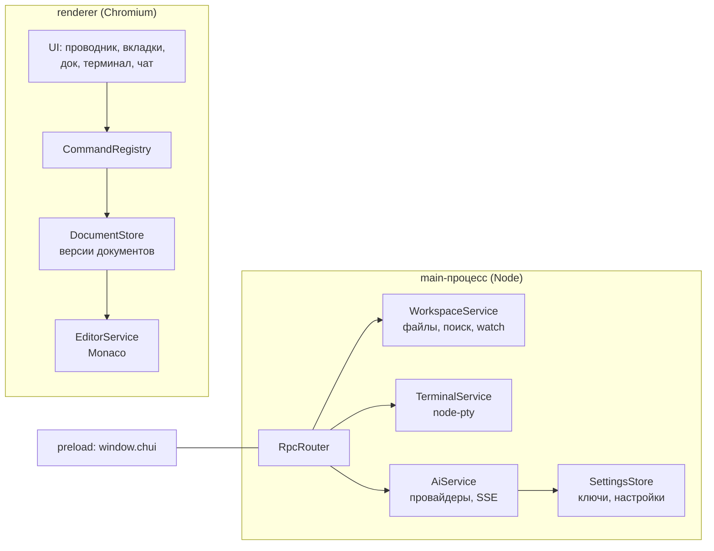

# Chui IDE

IDE на Electron и чистом TypeScript: раскладка в духе PyCharm New UI («острова» со скруглёнными
панелями), собственная светлая и тёмная палитра, подсветка кода цветами VS Code,
настоящий терминал на PTY, документная модель, реестр команд и готовый канал для AI-ассистента.

Смысл проекта — заложить то, что потом дорого переделывать: единый реестр команд,
версионируемый документ, RPC со стримингом и абстракция файловой системы. Ассистент
надстраивается сверху, а не врезается в середину.



## Быстрый старт

```bash
npm install
npm run rebuild        # пересобрать node-pty под ABI Electron (обязательно один раз)
npm run dev            # Vite + Electron, HMR для renderer
npm run build && npm start
```

Проверка кода — одной командой (типы, линт, юнит-тесты):

```bash
npm run check            # typecheck + lint + test — то же гоняет CI
npm run typecheck        # только типы (tsc --noEmit, main и renderer)
npm run lint             # Biome: ошибки и предупреждения
npm run lint:fix         # Biome: починить что можно автоматически
npm run format           # Biome: отформатировать
npm test                 # Vitest: юнит-тесты чистой логики
```

Линт и формат делает Biome (Rust) — у него свой парсер, поэтому он не зависит
от версии пакета `typescript`. Это важно: `typescript-eslint` требует TS < 7,
а проект собирается TS 7, так что связка ESLint + typescript-eslint здесь не работает.

Юнит-тесты (Vitest) покрывают только чистую логику — без Electron, Monaco и DOM:
правки текста с не-ASCII, поиск с заменой, проверку сессии, возможности моделей,
реестр языков, палитру тем, помощники чата и отбор файлов для быстрого открытия.
Проверки процессов и окна остаются за smoke-скриптами и «пробниками» ниже.

Проверки процессов и окна — без юнит-раннера, отдельными скриптами:

```bash
npm run smoke:pty        # node-pty в контексте Electron
npm run smoke:terminal   # TerminalService: сессия, ввод, вывод, resize, kill
npm run smoke:window     # арифметика своей рамки: перенос, растягивание, зажим по минимуму
npm run smoke:git        # GitService на временном репозитории: статус, индекс, коммит, diff, ветки
npm run smoke:launcher   # стартовое окно и переход в IDE: два окна, настоящий IPC
```

Когда проверка должна заглянуть внутрь настоящего окна IDE, берём «пробники» — они не
оценивают, а печатают состояние:

```bash
./node_modules/.bin/electron scripts/ide-probe.cjs     # открывается ли окно и что в дереве
./node_modules/.bin/electron scripts/fs-probe.cjs      # создание файла и папки, «Обновить», меню редактора
npm run probe:colors                                   # пиксель на экране против токенов темы (Linux + KDE)
npm run probe:menu                                     # меню «☰» настоящими кликами мыши и Alt+F10
```

«Пробники» возвращают видимые значения вместо `ok`/`FAIL`, потому что у окна IDE есть
подводный камень: `executeJavaScript` до `did-finish-load` копится в очереди, а частые
запросы друг за другом держат поток занятым — окно начинает считаться «не отвечающим».
Поэтому один запрос за раз и с запасом по времени.

Интерфейс можно посмотреть и в обычном браузере — без Electron и его окон: `scripts/ui-mock.js`
подставляется до загрузки страницы и отвечает на те же RPC-вызовы, но данными из памяти
(`page.addInitScript({ path: 'scripts/ui-mock.js' })` против работающего `npx vite`).
Это дешевле скриншотов и не поднимает второе окно.

Мок обязан повторять то же поведение, что и main: дерево он рисует по своим папкам,
а содержимое файлов держит отдельно, поэтому создание, переименование и удаление
правят оба списка. Иначе файл создаётся и открывается в редакторе, но в дереве не
появляется — проверка покажет несовершенство мока, а не ошибку интерфейса.

Требуется Node ≥ 20 (версия для разработки закреплена в `.nvmrc` — 22).
Проверено на Electron 44, Vite 8, TypeScript 7, Monaco 0.57, node-pty 1.1.

### Про нативный модуль

`node-pty` собирается под ABI обычного Node, а в Electron с таким бинарником падает с SIGSEGV.
Поэтому после установки нужен `npm run rebuild` (`@electron/rebuild`). Проверить результат:

```bash
npm run smoke:pty        # node-pty в контексте Electron
npm run smoke:terminal   # TerminalService целиком: сессия, ввод, вывод, resize, kill
```

## Что уже работает

**Старт приложения**

- Приложение открывается стартовым окном (`src/renderer/welcome.html`): кнопки «Открыть проект»
  и «Склонировать проект», список недавних проектов, а если история пуста — заглушка.
- Окно IDE создаётся после выбора: main открывает папку, запоминает её в `settings.json`
  (`workspace.recent`) и создаёт окно редактора. Стартовое окно закрывает сам лаунчер — уже
  получив ответ на `app.openProject`: если закрыть его в main, ответ отправлять будет некуда,
  и вызов в renderer не разрешится никогда. Окно IDE забирает уже открытый корень
  (`workspace.current`), поэтому папку не приходится выбирать дважды.
- Клонирование идёт через `git clone --progress` в выбранную папку, строки прогресса приходят
  в стартовое окно событиями вызова. Папку для клона пользователь выбирает сам, имя берётся из адреса.
- У стартового окна отдельная точка входа и своя сборка: Monaco и xterm в него не попадают.

**Интерфейс**

- Своя рамка окна: системной шапки нет — есть наша (меню приложения, заголовок,
  действия и кнопки окна), перетаскивание за шапку и растягивание за края.
- Раскладка в стиле PyCharm New UI: фон приложения темнее панелей, панели — «острова»
  со скруглёнными углами, зазоры между ними работают сплиттерами.
- Светлая и тёмная схемы (плюс «как в системе») — палитра устроена по ролям: поверхности,
  текст, линии, акценты. Переключается кнопкой в шапке, из меню «Вид» или палитры команд.
- Подсветка кода — цвета VS Code: Dark+ в тёмной схеме, Light+ в светлой.
- Знак приложения — «[i_i]» в стиле моноширинного шрифта: ровный штрих одной толщины,
  квадратная точка и засечки у «i», квадратные скобки во всю высоту клетки. Он же
  в пустом состоянии редактора и в значке окна (иконка для дистрибутивов — из него же).
- Слева больше нет полосы иконок: все переключатели живут в шапке. Слева — меню,
  боковая панель и работа с содержимым (сохранить всё, поиск, терминал),
  справа — ассистент, палитра, настройки, тема и кнопки окна. Кнопка ассистента носит знак
  приложения «[i_i]» — тот же, что в пустом состоянии редактора и в значке окна: кнопка
  и экран говорят одно и то же. В подсвеченном состоянии знак красится акцентом, как и
  остальные кнопки панелей.
- Сверху — панель с быстрыми действиями; имя открытого проекта показывает заголовок
  панели проекта (полный путь — в подсказке), а другую папку открывает меню (Ctrl+O).
- Редактор: вкладки с синей полосой у активной, хлебные крошки под ними. Колесо прокручивает
  полосу по горизонтали и доводит вкладку до края: и слева, и справа остаётся тот же отступ,
  что и без прокрутки (6 px). Если вкладки не помещаются, край полосы мягко уходит — по нему
  видно, что дальше есть ещё, и срезанная вкладка не выглядит обрубленной.
- Пустое состояние редактора — знак «[i_i]», имя и подсказки по горячим клавишам: кнопок нет,
  всё, что они делали, есть в меню «☰», в палитре команд и в дереве проекта.
- Снизу — док с вкладками «Поиск» и «Терминал», справа — «остров» AI Assistant.
- В шапке чата отступы такие же, как в полосе вкладок редактора, а крестик есть и у единственной
  беседы: закрытие не оставляет панель без вкладки, а заводит свежую беседу.

**Языки**

- Один реестр языков (`src/shared/languages.ts`): идентификатор для Monaco, подпись, расширения,
  имена файлов, отступы и значок. Из него берут данные редактор, дерево проекта, статусбар и запуск —
  поэтому подпись «Python» и правила подсветки не расходятся.
- Python и Node покрыты целиком: `.py`, `.pyi`, `.pyw`, `requirements.txt`, `pyproject.toml`,
  `Pipfile`, `setup.py`; `ts/tsx/mts/cts`, `js/mjs/cjs/jsx`, `package.json`, `tsconfig.json`,
  `package-lock.json`, `yarn.lock`, `pnpm-lock.yaml`, `.npmrc`, `.env`, `Dockerfile`, `Makefile`.
- Отступы задаёт язык, а не только общие настройки: Python — 4 пробела, TypeScript — 2,
  Makefile — символ табуляции. В статусбаре видно фактическое значение для открытого файла.
- Правила поведения прописаны там, где Monaco знает язык не полностью: `Ctrl+/` в Python,
  `.env` и Makefile, автоотступ после `def …:` и `if …:`, свои правила сворачивания.
- JavaScript и TypeScript проверяются настоящим языковым сервисом: `require`/`import` видны,
  импорты разрешаются, неиспользуемый код подчёркивается (отключается в настройках).
- Makefile подсвечивается своим мини-токенизатором: в сборке Monaco этого языка нет, а без него
  рецепты читаются как обычный текст. Грамматика короткая — цель, переменная, рецепт, `include`.

**Запуск кода**

- Кнопка запуска появляется сама, когда есть что запускать: файл Python, Node, Shell
  или задача из `scripts` в `package.json`. Нечего запускать — кнопки нет.
- Запускается то, чем нужно: интерпретатор виртуального окружения проекта
  (`.venv/bin/python` и родственные пути), а без него — `python3`; менеджер пакетов Node
  определяется по `packageManager` или файлу блокировки (`pnpm`, `yarn`, `bun`, `npm`).
- Точка входа отмечена значком ▶ на поле номера строки: `if __name__ == "__main__":`
  в Python, `require.main` — в Node. Клик по значку запускает файл так же, как `Ctrl+F5`.
- Команда набирается в терминале в каталоге проекта: процесс видно, его можно прервать
  и посмотреть вывод. Вкладка терминала называется по запуску (`Запустить train.py`).
- Перед запуском несохранённые файлы сохраняются (отключается в настройках).
- Виртуальные окружения — окно «Python: виртуальные окружения» (меню «Python» или палитра команд по слову `venv`): видно уже найденные, главное помечено, тут же создаётся новое — с выбором найденной в системе версии Python, набором пакетов и зависимостей из `requirements.txt`.
- Импорты с неустановленными библиотеками подчёркиваются прямо в редакторе: `import requests` (Python) или `import { z } from 'zod'` (JS/TS) помечаются предупреждением. Проверка своя, без языкового сервера: у Python IDE спрашивает интерпретатор проекта, что он видит, у JS/TS смотрит `node_modules` — и подчёркивает только то, чего нет. Стандартная библиотека, встроенные модули Node и свои файлы проекта при этом не трогаются. Окружение сменилось или файл открыли заново — проверка повторяется.
- Выбранный интерпретатор виден в статусбаре — клик открывает попап: чем запустится код, откуда взялся интерпретатор и переключатель между системным Python и найденными venv. Тот же выбор берёт языковой сервер — подсказки и запуск не разъезжаются. Сменили окружение или создали новое — IDE переключается сама: инструменты, карта проекта и серверы подсказок перечитываются.
- Пакеты окружения: попап показывает, сколько их стоит, сверяет установленное с `requirements.txt`
  (сколько зависимостей не хватает и какие именно) и ставит их одной кнопкой; то же доступно командой
  «Python: установить зависимости». Вывод `pip` идёт событиями — видно, что происходит.
- Форматирование: `Shift+Alt+F` или «Python: форматировать файл» — `ruff`, а без него `black` из окружения
  проекта. Правку проводит документ, поэтому работает undo; в настройках есть «Форматировать при сохранении».
- У подчёркнутого импорта есть быстрая правка (`Ctrl+.`): «Установить пакет». У Python его ставит
  `pip` в окружение проекта (имя пакета берётся из таблицы: `yaml` → `PyYAML`), у JS/TS —
  менеджер пакетов проекта (`npm`/`pnpm`/`yarn`/`bun`) в терминале.
- Подсказки не только вводятся: переименование, поиск ссылок, структура файла (символы) и быстрые
  правки от сервера. Набор быстрых правок зависит от того, какой сервер выбран (для Python по умолчанию
  `pylsp`; его код проверяют плагины — линтеры `pyflakes` и `pycodestyle`).
- `Ctrl+T` — поиск символа по всему проекту (`workspace/symbol`): класс, функция или переменная
  без знания файла; список спрашивается у сервера по мере ввода.
- Интерпретатор запоминается на проект (`run.pythonByRoot`): выбор в попапе окружения действует для этого
  проекта и не задевает другие.
- Переменные из `.env` подхватывают все, кто запускает код: установка пакетов, тесты, форматирование,
  терминал и языковой сервер видят одно окружение — строки подключения и токены не нужно повторять `export`.
- Панель тестов (`Тесты` в нижней панели): дерево файл → класс → тест от `pytest --collect-only`,
  запуск любого узла в терминале, кнопка «С покрытием» (`pytest --cov`) — её итог виден в сводке
  («покрытие 92%»). Исход прогона виден на узле (галочка/крестик): команда уносит в терминал
  печать кода выхода, панель читает её из вывода — оболочка после pytest не завершается, и кода
  выхода из события процесса не взять. Правка тестового файла пересобирает дерево сама — но не
  на каждое нажатие и не в фоне: с паузой в 1.5 с и только когда панель на виду. Сбор не удался —
  панель объясняет причину, а не молчит.
- Попап окружения замечает молчаливые поломки: `pyvenv.cfg` не читается, базовый интерпретатор
  из конфига пропал (обновили систему), в окружении нет pip. Это видно до первой неудачной команды.

**Отладчик**

- Отладка файла Python через `debugpy` (протокол DAP): `F5` запускает, `Shift+F5` останавливает.
  Точка останова — клик по полю номеров строк или `F9`, шаги — `F10`/`F11`/`Shift+F11`.
- Панель «Отладка» в нижнем доке: стек вызовов (клик по кадру открывает его и ставит курсор),
  переменные выбранного кадра с ленивым раскрытием, строка останова подсвечена в редакторе.
  Остановились в файле, которого нет на экране, — IDE сама открывает его на нужной строке.
- Отладчик берёт интерпретатор окружения проекта и его `.env` — то же окружение, что у запуска,
  тестов и языкового сервера. Адаптер запускается по stdio, порт не занимается.
- Точки останова помнятся по файлам, пока IDE открыта: вернулись к файлу — значки на месте.

**Проводник**

- Значки файлов и папок нарисованы своими руками (`ui/file-icons.ts`): цвет и буква говорят
  о виде файла (JS, TS, PY, `{}`, MD, `$`), у папок свои тона для `src`, `tests`, `dist`,
  `node_modules`, `.git`. Значки следуют схеме: в светлой палитре они темнее.
- Вид и поведение дерева настраиваются: значки, плотность строк, отступ уровня,
  сортировка, папки выше файлов, скрытые файлы, шаблоны исключений, пометки git,
  открытие по одинарному клику и подтверждение удаления.
- Статусбар как в PyCharm: путь к файлу, `строка:столбец`, `LF`, `UTF-8`, отступ, язык,
  а у Python-проекта — виджет окружения: клик открывает попап с выбором интерпретатора и списком venv.

**Git**

- Ветка и число файлов с правками — в статусбаре; клик открывает панель изменений.
- Панель «Изменения» в нижнем доке (`Ctrl+Shift+G`): поле сообщения коммита, два списка —
  проиндексированные и остальные правки, у каждой строки кнопка индексации.
- Файлы помечены буквами и цветом и в дереве проекта, и в списке изменений: `M`, `A`, `D`,
  `R`, `U` (новый), `!` (конфликт).
- Сравнение версий — отдельный экран поверх редактора (`Escape` закрывает): `staged` сравнивается
  с `HEAD`, остальное — с индексом. Открывается кликом по строке изменения.
- Переключение ветки — списком в панели; откат правок и коммит с пустым индексом
  спрашивают подтверждение системным диалогом.
- Всё через обычный `git` в main-процессе: чужие алиасы, хуки и настройки подписи работают как у вас,
  а renderer о репозитории знает только по снимку статуса и push-событиям `git:changed`.

**Редактор и проект**
- Проводник с ленивой загрузкой, инлайн-созданием и переименованием, контекстным меню.
- Пометки git: буква у файла и точка у папки, внутри которой есть правки (в свёрнутом дереве
  иначе не видно, что в папке что-то меняли); в подсказке — сколько правок внутри. Цветом
  помечается и весь путь к правке: имя родительской папки тоже красится, а не только файл.
  Несохранённые документы (в том числе правки ассистента до записи на диск) показываются
  как изменённые — git их ещё не видит, а человеку они важны.
- Создание файлов и папок, переименование, удаление в корзину (`shell.trashItem`).
  Имя вводится в дереве; создание в корне проекта тоже показывает поле — строка самого
  корня в дереве не рисуется, поэтому для неё есть отдельная ветка отрисовки.
- «Обновить» перечитывает папки, не схлопывая дерево: раскрытые папки и выделение
  остаются на месте (сброс происходит только при смене проекта).
- Пока открыто поле ввода имени, дерево не перерисовывается: перерисовка уносит
  поле из документа, а его `blur` закрывает ввод — со стороны это выглядело так,
  будто кнопка «Новый файл» ничего не делает.
- Языковые серверы (LSP): включаются в настройках, кнопка «Найти установленные»
  подбирает серверы по PATH; их пометки показываются в редакторе рядом с собственными.
- Поиск по проекту: регулярки, glob-маска, переход к совпадению.
- Замена по проекту: поле «Чем заменить» рядом с поиском, кнопка «Заменить все».
  Идёт в main по тем же файлам, что и поиск; открытые вкладки перечитываются сразу
  (см. «перечитывание файла»), поэтому в редакторе видно результат без переоткрытия.
- Быстрое открытие файла (`Ctrl+Shift+O`): список файлов проекта с отбором по
  подпоследовательности символов — «qjs» находит `src/queue.js`; совпадение в имени
  файла весит больше, чем в пути.
- Сессия проекта переживает перезапуск: открытые вкладки, раскрытые папки и видимость
  панелей восстанавливаются при следующем открытии папки. Хранится по файлу на проект
  рядом с беседами (`userData/sessions`).
- Monaco с подсветкой и TS/JSON/CSS/HTML-сервисами в web worker'ах, тема под Darcula.
- Интерфейс редактора на русском: контекстное меню, палитра `F1`, поиск и подсказки — строки
  из пакета переводов Microsoft (см. «Локализация редактора»).
- Автообновление при изменении файлов на диске (`fs.watch` с debounce): перечитывается
  дерево, а открытый файл подхватывает новое содержимое — правка внешним инструментом
  или в терминале видна сразу. Несохранённые правки при этом не теряются: «грязный»
  документ не трогаем, пока его не сохранит или не откатит пользователь.

**Терминал**

- Настоящий PTY (`node-pty`) в main-процессе, отрисовка `xterm.js` в renderer.
- Несколько сессий с вкладками, свой рабочий каталог, `resize` при изменении панели,
  завершение процесса, очистка экрана.
- Вывод склеивается в main по 8 мс, чтобы не топить IPC мелкими чанками.

**AI**

- Провайдеры OpenAI-совместимого API: OpenAI, Groq, Ollama, llama.cpp, LM Studio.
- Стриминг ответа, остановка генерации, выбор модели, ключ хранится только в main.
- Палитра команд (`Ctrl+Shift+P`), меню приложения, горячие клавиши, уведомления.
- К вопросу можно прикладывать контекст: `#selection`, `#file`, `#problems` — и изображения:
  кнопка «+» → «Изображение из файла…» (системный диалог), либо `Ctrl+V` из буфера (скриншот),
  либо перетаскивание файла на панель чата. Файлы читает main и отдаёт data-URL — renderer
  файловой системы не видит.
- Вложение-картинка показывается миниатюрой с именем и размером. В модель оно уходит частями
  содержимого последнего сообщения пользователя (`image_url` с data-URL) — так это понимает
  любой OpenAI-совместимый API; текстовый контекст по-прежнему едет отдельным system-сообщением.
- Пределы: 4 изображения на вопрос, 5 МБ на изображение; проверяются и в интерфейсе, и в main
  (данные вставки из буфера собирает renderer, поэтому он не источник истины).
- Инструменты агента (описания — `src/shared/tools.ts`, исполнение — `src/main/ai/agent-tools.ts`):
  чтение проекта (`list_dir`, `read_file`, `read_files`, `search`, `find_files`, `get_diagnostics`),
  правки и файловые операции (`apply_edit`, `replace_in_files`, `create_file`, `delete_file`, `move_file`),
  запуск (`run_terminal`, `terminal_*`), git (`git_status`, `git_diff`, `git_log`),
  интерфейс (`open_file`) и `update_plan`. Где исполняется инструмент — свойство `side`
  контракта: файлы и git — в main, правки и диагностика — в renderer.
- `find_files` ищет по glob-маске пути (`**` — любая глубина, `*` — в пределах сегмента),
  `search` умеет учитывать регистр и режим `filesOnly` (только пути файлов с совпадением),
  `read_files` читает 2–5 файлов за один вызов, `replace_in_files` делает массовую замену
  (с той же маской glob), `git_log` — read-only история коммитов.
  Разбор маски — в `src/shared/glob.ts`, замена — в `src/shared/replace.ts`.

## Своя рамка окна

Окно создаётся без системных украшений (`frame: false`) — рамку рисует renderer.
На macOS вместо этого `titleBarStyle: 'hiddenInset'`: там остаются системные «светофоры»,
а свои кнопки скрываются (иначе окно теряет привычное управление).

| Что обычно делает оконный менеджер | Кто делает здесь |
|---|---|
| перетаскивание за шапку | CSS `app-region: drag` на шапке (жест ведёт Chromium через WM) |
| кнопки свернуть/развернуть/закрыть | `core/window-frame.ts` → RPC `window.*` |
| растягивание за края | невидимые полосы по краям окна → `window.setBounds` с зажимом по минимуму в main |
| полоса меню | кнопка «☰» открывает меню, которое рисует renderer (`app.showMenu`) — то же попап-меню, что и контекстные; пункт-роль (буфер обмена, масштаб, окно) идёт в main через `menu.role` |
| состояние «развёрнуто» | push-событие `window:state`: кнопка меняет иконку, края прячутся |

Системное меню Electron при этом остаётся: оно держит горячие клавиши, которые renderer
не увидит (масштаб, полный экран, инструменты разработчика), и у безрамочного окна просто
не показывается. Структура у обоих меню одна — `shared/app-menu.ts`.

Обе страницы (`index.html` и `welcome.html`) создают `WindowFrame` и вызывают
`refresh()`: без него окно не узнаёт про свою рамку — не встаёт класс
`has-custom-frame`, не приходят заголовки кнопок и прячутся края.

Значки кнопок берутся у системы: на Linux (Plasma рисует шевроны) — `⌄` свернуть,
`⌃` развернуть, двойной шеврон вверх — восстановить; на остальных платформах
привычные `− □ ✕`. На macOS кнопок нет вовсе — там системные «светофоры».

## Шрифты

Оба семейства лежат в проекте, а не берутся из системы: интерфейс — Inter,
код и терминал — JetBrains Mono. Файлы — переменные (variable), поэтому на всё
приложение их четыре: `InterVariable.ttf`, `InterVariable-Italic.ttf`,
`JetBrainsMonoVariable.ttf`, `JetBrainsMonoVariable-Italic.ttf`
(`src/renderer/assets/fonts/`). Один файл закрывает весь диапазон начертаний
(Inter 100–900, JetBrains Mono 100–800), поэтому вместо десятков начертаний — четыре файла,
а вес выбирается точно, без подмены ближайшим.

Подключение — `src/renderer/styles/fonts.css` (`@font-face`), он импортируется
в обеих точках входа (`main.ts`, `welcome.ts`) до темы. Имена семейств — ровно те,
что уже просит код: `--font_ui` в `theme.css` начинается с `'Inter'`, `--font_mono`,
`editor-service.ts` и `ui/terminal.ts` — с `'JetBrains Mono'`; дальше везде системные
запасные варианты, поэтому sans-serif и monospace остаются в стеке как страховка.
Лицензия у обоих — SIL Open Font License 1.1, тексты лежат рядом с файлами.

Два места измеряют метрики шрифта до того, как файл загрузится, и их приходится
пересчитывать: Monaco — `document.fonts.load()` плюс `monaco.editor.remeasureFonts()`,
xterm — `fit.fit()` с `refresh()` (иначе ширина символа и сетка терминала посчитаны
по запасному шрифту). Интерфейсу это не нужно: `font-display: swap` меняет шрифт
сразу после загрузки локального файла.

## Локализация редактора

Строки Monaco — контекстное меню, палитра `F1`, поиск, подсказки, метки доступности —
библиотека берёт из таблицы `globalThis._VSCODE_NLS_MESSAGES`, а переводы Microsoft
кладет в сам пакет: `monaco-editor/nls/lang/<язык>.js` (в 0.57 это 2138 строк для русского).
Русский поэтому включается одним импортом в `src/renderer/main.ts`:

```ts
import 'monaco-editor/nls/lang/ru.js';   // обязательно до `./app`
```

Порядок важен: подписи действий читаются при загрузке модулей Monaco, а не при первом
показе меню. В стартовом окне импорта нет — Monaco туда вообще не попадает.

Что остается английским: диагностики TypeScript из web worker'а — публичного способа
передать ему локализованные сообщения у Monaco нет (`setLocalizedDiagnosticMessages`
есть только внутри `typescriptServices.js`). Формулировки перевода — из VS Code, местами
спорные («Копирование» вместо «Копировать»); переопределять их по индексам таблицы не стоит,
надёжнее дать свою подпись своему действию.

## Оформление попапов редактора

Меню по правой кнопке, палитра `F1`, поиск, подсказки и окно параметров рисует Monaco,
и по умолчанию они выглядят как VS Code, а не как наше приложение. Приведены к общей
системе в три слоя:

- **Цвета** — `core/theme.ts`. Задано больше сотни идентификаторов Monaco: сам редактор,
  а также попапы (`menu.*`, `quickInput*`, `list.*`, `input.*`), поиск (`editor.findMatch*`),
  диагностика (`editorError/Warning/Info`) и экран сравнения (`diffEditor*`, цвета из `--git_*`).
  Заливка «это текущее» одна и та же, что у дерева и вкладок: `--selection_background`
  в непрозрачном виде (`#154162` в тёмной схеме, `#dbeeff` в светлой).
- **Переменные `--vscode-*` и палитра команд** — `styles/monaco.css`. Библиотека читает эти
  переменные в своих правилах (в VS Code их объявляет сама оболочка), поэтому радиус, тень,
  толщина рамки и ступени текста попапов задаются нашими токенами. Здесь же — попапы,
  которые Monaco рисует в обычном DOM редактора (`quick-input-widget`, `find-widget`,
  `suggest-widget`, `monaco-hover`, `parameter-hints-widget`): палитра `F1` и прочие быстрые
  вводы приведены к нашему `.palette` — плотная поверхность карточки, радиус 12 px, модальная тень,
  шрифт Inter, заголовок с полем без рамки, отступ строк 6 px с радиусом 8 px,
  сочетания клавиш как `.palette-item-key` (рамка, JetBrains Mono, 10.5 px), анимация `popup-in`.
  Цвета этих попапов Monaco рисует inline-стилями из темы, поэтому в `monaco.css` они
  перекрываются `!important`.

  Чего сделать нельзя: высоту строки списка в палитре. Список виртуализированный,
  шаг строк (22 px) считается в JS — правка CSS-высоты приводит к наезду строк друг на друга,
  проверено. Чтобы не было двух разных палитр, `F1` внутри редактора перенаправлен
  на нашу палитру (`Ctrl+Shift+P`): `editor-service.ts` → `monaco.editor.addCommand`
  плюс динамическая привязка `addKeybindingRule`, она перекрывает встроенную
  `editor.action.quickCommand`.
- **Материал меню** — `core/monaco-chrome.ts`. Меню по правой кнопке живёт в shadow root
  (`div.shadow-root-host` → `.monaco-menu`), куда правила страницы не заходят: модуль
  дописывает один небольшой стиль внутрь корня и следит за DOM, потому что корни создаются
  лениво (их же создаёт и экран сравнения).
  Там же меню приведено к нашим попапам: отступ контейнера 4 px, пункт `5px 9px` с радиусом 8 px
  и зазором 12 px, высота строки из токена `--line_height_ui`, сочетание клавиш 11 px
  в третьей ступени текста, разделитель 1 px с отступами `4px 6px` — всё как у `.context-item`
  и `.select-item`. Свои правила Monaco вставляет в корень позже нашего стиля, поэтому
  перекрываем их удвоенным селектором (так же делает и сам Monaco в правилах повышенного
  контраста), а где у Monaco стоит `!important` — там и у нас он есть.

Три ловушки, на которые стоит смотреть при обновлении Monaco:

- `--vscode-menu-border` обязателен: в правиле меню он используется как единственный цвет,
  а в подстановке стоит имя цвета (`editorWidget.border`), и без переменной вся декларация
  `border` считается неверной — рамки нет вовсе.
- Палитра и поиск — **не** shadow root, а обычный DOM внутри `.monaco-editor .overflow-guard`,
  поэтому их достаточно стилизовать CSS. Полагаться на «Monaco всегда в shadow root» нельзя:
  у разных попапов по-разному.
- Меню и быстрые вводы рисуются в теневом корне рядом с `body`, **вне редактора**: переменные
  темы Monaco там нет, потому что он объявляет их на самом редакторе. Без своей заливки
  у меню остаётся только рамка над просвечивающим кодом, а `var(--vscode-menu-background)`
  не разрешается ни во что. Поэтому `--vscode-menu-background` и `--vscode-quickInput-background`
  объявлены на `:root` (`styles/monaco.css`, значение — `--popup_background`), а в стиле
  теневого корня у `.monaco-menu` и `.quick-input-widget` фон задан ещё и явно — чтобы вид
  не зависел от того, какое правило Monaco победит.

## Темы и палитра

Цвета живут только в `src/renderer/styles/theme.css` — в обеих схемах один и тот же набор ключей,
а компоненты берут их ключом (`var(--…)`). Своих значений цвета в стилях компонентов нет: такое
значение не меняется вместе со схемой и выпадает из палитры.

Ключи названы по ролям, а не по цвету: поверхности, текст, линии, акценты, тени, движение:
`--main_background`, `--element_background_2`, `--sunken_background`, `--text_color`,
`--border_color`, `--separator_color`, `--blue_prime_background`, `--radius_sm`, `--motion_fast`.
Роли поверхностей: окно темнее содержимого, контрол лежит относительной заливкой,
углубление рисуется накладкой.

Значения взяты из таблиц системных цветов Apple HIG; системное имя указано рядом с ключом.

```
окно      --main_background             windowBackgroundColor   #161618 / #ececec
карточки  --element_background_2        поверхность содержимого #1e1e1e / #ffffff
полотно   --editor_background           цвета VS Code           #1e1e1e / #ffffff
текст     --text_color                  label (четыре ступени)  #ffffffD9 / #000000D9
рамка     --border_color                systemGray4 / Gray3     #3a3a3c / #c7c7cc
разделит. --separator_color             separatorColor          #545458A6 / #3C3C4349
акцент    --blue_prime_background       systemBlue              #0091ff / #0088ff
выделение --selection_background        акцент в поверхность
строка    --line_height_ui              1.45 — общая для текста и меню Monaco
```

Поверхностей ровно три: окно, карточка, углубление. Окно всегда самое тёмное
(в светлой схеме — самое серое), карточка лежит на нём светлее, углубление рисуется
накладкой поверх карточки. Поэтому в тёмной схеме окно `#161618`, а карточка `#1e1e1e`:
подъём показан светлым слоем, а не тенью. Карточка совпадает с полотном редактора,
значит активная вкладка сливается с кодом и «остров» читается одной поверхностью.
Отдельно оговорены две рамки: контур блока тише (`--border_color`), контур контрола
плотнее (`--button_border_color`) — иначе каждая карточка превращается в светлую сетку.

Подсветка кода — цвета VS Code (Dark+ и Light+): комментарий `#6a9955`/`#008000`,
строка `#ce9178`/`#a31515`, ключевое слово `#569cd6`/`#0000ff`, тип `#4ec9b0`/`#267f99`,
идентификатор `#9cdcfe`/`#001080`, число `#b5cea8`/`#098658`. Эти значения живут в
`core/theme.ts`, а не в CSS: Monaco не умеет читать переменные, и второй копии быть не должно.

Перед применением палитра проходит через `vivid()`: оттенки те же (VS Code), но
насыщенность поднята на ×1.1 + 6 %, а в тёмной схеме и светлота — на 14 % остатка до белого:
в чате код лежит на более тёмной подложке, чем полотно редактора, и цвета Dark+ там читались
вяло. Усиление применяется к ОДНОЙ таблице, из которой собираются и правила Monaco, и цвета
чата, поэтому редактор и чат показывают один и тот же цвет.

Цвета состояний git (`--git_*` и `chrome.added/modified/deleted`) — тоже цвета VS Code
(`#81b88b`, `#e2c08d`, `#c74e39`; в светлой схеме `#587c0c`, `#895503`, `#ad0707`)
с той же ступенью усиления. В светлой схеме переименование и новый файл делят зелёный —
как в VS Code: состояния различает буква пометки (`R` и `U`), а не оттенок.

**Цвет на экране.** Токены заданы в sRGB, и пиксель на экране должен совпадать с записанным
числом. Вид зависит не только от CSS: цветоуправление работает в композиторе. Поэтому main
держит два флага:

- `--force-color-profile=srgb` — страховка на случай широкоохватного экрана: без него
  цветоуправляемый Chromium пересчитывает sRGB в профиль дисплея;
- `--disable-features=WaylandWpColorManagerV1` — про Wayland: Chromium ведёт окно через
  протокол `wp_color_manager_v1`, и тёмные тона уезжают вверх. Замер пикселя: без флага
  токен `#1e1e1e` даёт на экране `#232323` (сдвиг +5), `#161618` → `#1c1c1e` (+6),
  а чёрный и белый остаются на месте — то есть чужая кривая, а не прозрачность.
  `force-color-profile` такого сдвига не лечит: он про профиль монитора, а тут кривая
  на самом окне. Со снятым протоколом все плашки совпадают с токенами точно.

Проверка — `npm run probe:colors`: пробник рисует плашки известных цветов, сам снимает
ЭКРАН (`spectacle`) и читает пиксели. Именно экран, а не `capturePage()`: он отдаёт кадр
Chromium, то есть до композитора, и показывает расхождение только если его вносит сам
Chromium — сдвиг тёмных тонов в таком кадре не виден вообще.

**Доступность.** У акцентов в таблицах HIG есть отдельная колонка значений для повышенного
контраста — она включается в `prefers-contrast: more` (текст становится непрозрачным,
разделители плотными). Ступени текста в тёмной схеме выше светлых: полупрозрачный белый
на тёмном фоне теряет контраст быстрее, чем полупрозрачный чёрный на светлом, и общий шаг
давал серое по серому — иерархия читалась как грязь. Всплывающие слои — обычная поверхность
карточки: прозрачности и блюра нет, слой держат рамка и тень (раньше это был материал
с `backdrop-filter`, но полупрозрачные фоны оказались лишними).
становятся плотной поверхностью. Анимации выключаются при `prefers-reduced-motion: reduce`.

**Как переключается.** Выбор хранит main: он выставляет `nativeTheme.themeSource`, и CSS
переключается сам — Chromium сразу отдаёт новое значение `prefers-color-scheme`, правок в DOM
не нужно. А то, что CSS-переменными не описать (Monaco и xterm), получает фактическую схему
push-событием `theme:changed`: полагаться на событие `matchMedia` в renderer нельзя — оно
приходит не во всех окружениях. Выбор лежит в `settings.json` (`appearance.theme`)
и переживает перезапуск.

## Горячие клавиши

| Клавиши | Действие |
|---|---|
| `Ctrl+O` | открыть папку |
| `Ctrl+S` / `Ctrl+Shift+S` | сохранить файл / всё |
| `Ctrl+W` | закрыть вкладку |
| `Alt+F12` | терминал (открыть/свернуть) |
| `Ctrl+Shift+F` | поиск по проекту |
| `Ctrl+Shift+P` | палитра команд |
| `Ctrl+Shift+O` | быстрое открытие файла |
| `Ctrl+B` | боковая панель |
| `Ctrl+Shift+G` | изменения (панель git) |
| `Ctrl+Shift+A` | панель AI |
| `Ctrl+F5` | запустить активный файл |
| `Shift+F10` | выбрать, что запустить |
| `F5` | отладка: запустить / продолжить |
| `Shift+F5` | отладка: остановить |
| `F9` | точка останова на строке курсора |
| `F10` / `F11` / `Shift+F11` | шаг с обходом / с заходом / из функции |
| `Ctrl+,` | настройки |
| `Alt+1` / `Alt+2` | проект / поиск |

## Сборка дистрибутивов

Пакеты собирает `electron-builder` по одному описанию — `electron-builder.yml`:

| Система | Формат | Команда |
|---|---|---|
| Linux | AppImage, deb | `npm run dist:linux` |
| Windows | NSIS (установщик) | `npm run dist:win` |
| macOS | dmg | `npm run dist:mac` |

- Готовые файлы складываются в `release/` (каталог в `.gitignore`) вместе с `*.blockmap`
  для автообновления.
- Значок приложения рисуется кодом: `npm run icon` → `build/icon.png` (512×512).
  Тёмная плитка с синим знаком «[i_i]» цвета палитры: фон — полотно редактора и фон окна,
  контур — цвет линий, знак — акцент (`--blue_prime_background`). Геометрия знака лежит
  в одном месте (`src/shared/logo.ts`) и состоит ТОЛЬКО из прямоугольников — её читают оба
  движка: SVG в интерфейсе (`renderer/ui/logo.ts`) и растеризатор значка (`scripts/make-icon.mjs`).
  Ни кривых, ни ломаных: меньше поводов разойтись в сглаживании. Текстом знак не рисуется
  намеренно — в сборщике значков нет шрифтов. Из одной картинки 512×512 сборщик делает
  `.ico` для Windows и `.icns` для macOS: держать три бинаря в репозитории не нужно.
- `node-pty` — нативный модуль, поэтому перед упаковкой он пересобирается под Electron
  (`npmRebuild: true`), а из asar исключается: `asarUnpack` с `**/*.node` и `node_modules/node-pty/**`.
- deb требует сопровождающего (`linux.maintainer`), AppImage — имени `.desktop`-файла,
  совпадающего с тем, что сообщает окно (`desktopName` в `package.json` + `syncDesktopName`).
  Без второго композитор не связывает окно с ярлыком: в доке нет иконки.

Обычные проверки живут отдельным workflow — `.github/workflows/ci.yml`: на каждый push
и pull request он гоняет `npm run check` (типы + линт + тесты), собирает main и renderer
и запускает smoke правок с не-ASCII. Сборка дистрибутивов — только к релизу.

Автоматическая сборка — `.github/workflows/release.yml`. Матрица из трёх платформ,
каждая собирается на своей системе (кросс-сборки Electron нет): `ubuntu-latest` — AppImage и deb,
`windows-latest` — NSIS, `macos-latest` — dmg. Шаги: `npm ci` → `npm run typecheck` → `npm run build`
→ `electron-rebuild -w node-pty` → `electron-builder <цель> --publish never` → выгрузка артефактов.
Запуск — по тегу `v*` или вручную; публикация в релиз идёт отдельной задачей только для тега,
релиз создаётся черновиком. macOS-сборка не подписывается (`identity: null`): для подписи
нужны сертификат и секреты репозитория, и это осознанно оставлено на стороне проекта.

## Как это устроено

### Два процесса и один контракт

Весь обмен описан в одном файле — `src/shared/api.ts`: каналы IPC, доменные типы и таблица
методов `ChuiMethods`. Из имени метода выводятся типы аргументов и результата, поэтому
опечатка в имени — ошибка компиляции, а не тихий отказ в рантайме.

```ts
router.register('terminal.write', (params) => { deps.terminals.write(params.id, params.data) });

const session = await rpc.request('terminal.create', { cols: 80, rows: 24 }); // TerminalSession
```

Долгие вызовы стримят события внутри себя: идентификатор запроса генерирует renderer, поэтому
`ctx.emit(...)` в main доходит до конкретного вызова, а `rpc.cancelActive()` обрывает его через
`AbortController` — вплоть до `fetch` к модели.

Терминал использует push-события (`terminal:data`, `terminal:exit`): сессия живёт дольше любого
запроса, поэтому привязывать её к вызову нельзя.

### Реестр команд — точка расширения

Любое действие проходит через `CommandRegistry`: пункт меню, кнопка, горячая клавиша, палитра.
Меню Electron не содержит логики — оно шлёт в renderer идентификатор команды.

```ts
define({ id: 'file.save', title: 'Сохранить', category: 'Файл' }, async () => { /* … */ });

await commands.execute('file.save'); // из UI, из палитры, из тестов и (позже) из инструментов ассистента
```

### Документ — источник истины, Monaco — представление

`TextDocument` владеет текстом и версией и не знает про Monaco. Правило одного писателя:

- пользователь печатает → модель Monaco сообщает документу (`source: 'user'`);
- правки программные (ассистент, диск) → документ сообщает модели (`pushEditOperations`),
  поэтому `Ctrl+Z` отменяет и правку ассистента тоже.

`expectedVersion` в `FileEdit` защищает от гонок: правка для устаревшей версии отклоняется.

### Файловая система за абстракцией

Renderer не трогает `node:fs`. Всё идёт через `WorkspaceService`, который проверяет, что путь
не выходит за пределы рабочей папки (по нормализованному пути и по `realpath`). Удаление —
только в корзину: безвозвратный `rm` из IDE — слишком дорогая ошибка.

## Структура

```
biome.json           линт и формат (Biome)
vitest.config.mts    юнит-тесты (Vitest)
.github/workflows/   ci.yml (проверки на push/PR), release.yml (дистрибутивы по тегу)
tests/               юнит-тесты чистой логики (31 файл): edits, replace, session, glob,
│                    tools, providers, languages, theme, chat-text, quick-open-rank,
│                    imports/import-install, env-file/project-env, project-scan,
│                    python-env/-health/-packages/-tests, node-packages, uri-path,
│                    git-model, path-guard, debug (DAP против фейкового адаптера), lsp-*

src/
├── shared/            контракт: api.ts (типы + методы), bridge.ts, tools.ts, app-menu.ts,
│                      languages.ts (реестр языков), edits.ts (правки TextEdit),
│                      replace.ts (поиск с заменой), session.ts (проверка сессии),
│                      glob.ts (маски файлов), providers.ts,
│                      imports.ts (разбор импортов), import-install.ts (что предложить поставить),
│                      python-env/-health/-packages/-tests, env-file.ts (разбор .env),
│                      project-scan.ts (карта проекта),
│                      lsp-presets.ts, lsp-symbols.ts
├── main/
│   ├── index.ts       сборка сервисов, single-instance, выключение терминалов
│   ├── window.ts      безрамочное окно, его состояние и арифметика размеров
│   ├── protocol.ts    схема app:// для продакшена (иначе не работают worker'ы Monaco)
│   ├── menu.ts        меню → команды в renderer
│   ├── settings.ts    settings.json + ключи из окружения
│   ├── session-store.ts  сессия проекта (вкладки, папки, панели) — по файлу на проект
│   ├── ipc/           router.ts (RPC), register.ts (связка с контрактом), push.ts
│   ├── workspace/     файлы, поиск, watch, проверка путей
│   ├── terminal/      node-pty: сессии, склейка вывода, буферы
│   ├── ai/            provider.ts, openai-compatible.ts (SSE), anthropic.ts, service.ts,
│   │                  chat-store.ts (беседы), agent-tools.ts (инструменты агента)
│   ├── lsp/           языковые серверы: жизненный цикл, диагностики,
│   │                  detect.ts (поиск команд в PATH)
│   ├── debug/         debug.ts (отладчик: клиент DAP поверх debugpy)
│   ├── python/        environments (окружения), interpreters (поиск в системе),
│   │                  pip (установка), packages (что видит интерпретатор),
│   │                  tests (сбор тестов), format (ruff/black), health (поломки venv)
│   ├── node/          packages.ts (что видит проект: каталоги node_modules)
│   ├── project/       scan.ts (обход проекта без чтения содержимого)
│   └── project-env.ts переменные из .env — для запуска, терминала и языкового сервера
├── preload/index.ts   мост window.chui
└── renderer/
    ├── app.ts         композиционный корень: сервисы + команды + подписки
    ├── styles/        theme.css (палитра, две схемы), main.css (раскладка и компоненты)
    ├── core/          document, document-store, editor-service, edits, commands,
    │                  keybindings, open-editors, workspace-model, rpc, host,
    │                  languages (реестр из shared), language-modes (правила Monaco),
    │                  project-tools (интерпретатор и менеджер пакетов),
    │                  run-config (что можно запустить), python-view (подписи окружения),
    │                  import-check (подчёркивание «модуль не установлен»),
    │                  import-actions (быстрая правка «установить пакет»),
    │                  lsp (синхронизация с сервером), lsp-providers (подсказки Monaco),
    │                  git-model (пометки git по путям), debug (состояние отладки),
    │                  highlight (код в чате),
    │                  quick-open-rank (отбор файлов для Ctrl+Shift+O),
    │                  popup-placement (где рисовать попап), monaco-chrome, monaco-env,
    │                  theme (темы Monaco и xterm), theme-service (смена схемы),
    │                  window-frame (своя рамка: кнопки и края)
    └── ui/            layout (острова), dock, terminal, explorer, file-icons,
                       tabs, breadcrumbs, run-button, search, chat, chat-text,
                       chat-markdown, chat-tools, quick-open, palette,
                       symbol-picker (Ctrl+T: символ по проекту),
                       python-env-popover, venv-modal (окружения Python),
                       test-panel (дерево тестов), debug-panel (отладка),
                       source-control (git), diff-view,
                       popup-menu, context-menu, popover, select,
                       statusbar, settings-modal, session-info, launcher, toast, dom
```

## Подключение модели

Провайдеры настраиваются в `~/.config/chui-ide/settings.json` (кнопка «settings.json» слева внизу).

```json
{
  "ai": {
    "providers": [
      { "id": "openai", "label": "OpenAI", "baseUrl": "https://api.openai.com/v1",
        "models": ["gpt-4o-mini"], "defaultModel": "gpt-4o-mini" },
      { "id": "local", "label": "llama.cpp", "baseUrl": "http://127.0.0.1:8080/v1",
        "models": ["qwen2.5-coder"], "defaultModel": "qwen2.5-coder" }
    ],
    "activeProviderId": "openai"
  }
}
```

Ключ можно не писать в файл: `OPENAI_API_KEY`, `GROQ_API_KEY`, `ANTHROPIC_API_KEY`, общий
`CHUI_API_KEY`. Ключ живёт только в main-процессе — в renderer уходит лишь флаг `hasApiKey`.
Для локальных адресов ключ не требуется. В системный промпт подмешиваются путь к проекту
и содержимое `AGENTS.md` / `CHUI.md` / `CLAUDE.md`.

## Безопасность

- `contextIsolation: true`, `nodeIntegration: false`; в renderer доступен только `window.chui`.
- `sandbox: false` — осознанный компромисс: preload использует общий контракт из `shared/api.ts`.
- Секреты только в main. CSP запрещает renderer'у ходить в сеть наружу, кроме dev-сервера.
- Любой путь нормализуется и проверяется на выход за пределы рабочей папки: и лексически
  (`..`), и по симлинку. Исключение одно — чтение метаданных (`stat`): симлинк наружу там
  разрешён, иначе IDE не увидела бы интерпретатор виртуального окружения.
- Удаление файлов — через корзину.

## Что дальше

**Мелочи, которые заметны каждый день.** Хлебные крошки и путь в статусбаре — по клику
открывать палитру быстрого перехода. Поиск по открытым вкладкам, а не только по проекту.

**Отладчик.** Есть базовый набор: точки останова, стек, шаги и переменные поверх `debugpy`.
Дальше — условные точки останова и точки в журнал (DAP это умеет, `debugpy` поддерживает),
выражения для наблюдения, и отладка с параметрами запуска (аргументы, переменные окружения).
Ещё один язык потянет за собой свой адаптер — сейчас путь жёстко про Python.

**Панель тестов.** Построчное покрытие по файлам: из отчёта `pytest --cov` берётся пока только
итог. И собственный значок ▶ у `def test_…` в жёлобе — сейчас точки входа помечаются лишь у
`if __name__ == "__main__":` (чтобы жёлоб не пестрел стрелками у каждого теста).

**Упаковка.** Подпись дистрибутивов (macOS не нотаризуется). Языковые грамматики Monaco Vite
уже выносит в отдельные чанки и грузит по требованию — тяжёлым остаётся только ядро редактора,
и его дробление смысла имеет мало.

**Качество.** Разбирать `renderer/ui/chat.ts` — он разросся до ~2 600 строк, его стоит поделить
на стриминг, композер и панель изменений (чистые помощники уже вынесены в `chat-text.ts`).

**LSP.** Языковые серверы поднимаются по настройке; в разделе «Языки (LSP)» кнопка
«Найти установленные» проверяет PATH и главное окружение проекта. Если LSP включён,
а список серверов пуст, IDE подставит найденные сама — при открытии проекта.
Дальше можно расширять список пресетов (`shared/lsp-presets.ts`) и добавлять языки по мере надобности.
Стоит помнить: базовый `python-lsp-server` код не проверяет — диагностику дают его плагины
(`pyflakes`, `pycodestyle`); набор «Полное окружение» ставит их вместе с сервером.

## Ограничения текущей версии

- Переводы строк нормализуются к `\n` — CRLF-файлы перезаписываются в LF.
- LSP выключен по умолчанию. Включить проще всего кнопкой «Найти установленные»
  в разделе «Языки (LSP)»: IDE проверяет PATH и подставляет известные серверы
  (pylsp/pyright, typescript-language-server, rust-analyzer, gopls и другие). Автозапуска
  без вашего ведома нет. Подсветка, отступы, комментарии и запуск работают и без LSP;
  JavaScript и TypeScript дополнительно проверяет языковой сервис Monaco.
- Отладчик есть, но без условных точек останова, точек в журнал и выражений для наблюдения:
  это базовый набор — точки, стек, шаги, переменные.
- Дистрибутивы не подписаны: macOS-сборка не нотаризуется, поэтому при первом запуске
  система попросит подтверждение.
- Переименование открытого файла закрывает и заново открывает его вкладку (модель Monaco
  нельзя переиспользовать с новым путём).
- Интерфейс рассчитан на Linux/macOS-пути (POSIX-разделители в хлебных крошках).

## Если окно «не отвечает»

Симптом: окно замирает, в консоли main `unresponsive`, у процесса `--type=renderer` загрузка
ядра около 100 %. Это почти наверняка цикл обещаний в renderer: короткая цепочка `.then`,
которая каждый раз запускает себя заново. Она не отдаёт управление ни отрисовке, ни IPC —
поэтому и «не отвечает», и греет процессор.

Так было в проводнике: `load` при повторном запросе той же папки просто выходил, а вызвавшая
сторона получала уже разрешённое обещание и сразу перерисовывала дерево. Достаточно, чтобы
во время первого чтения корня произошла ещё одна отрисовка — от события git или от открытия
файла, — и поток оставался в микротасках навсегда. Теперь `load` возвращает тот же незавершённый
промис, а папка, которую прочитать не удалось, сама по себе не перечитывается (только
по «Обновить»): иначе каждый проход отрисовки заново просил ту же папку.

Искать такое стоит не в догадках, а в состоянии: `scripts/fs-probe.cjs` и `scripts/ide-probe.cjs`
печатают дерево и отвечает ли окно, а загрузка ядра (`ps -o pcpu,args | grep renderer`) отличает
цикл от взаимной блокировки. Отладчик Chromium в этом случае не помощник: пока поток занят
микротасками, он не обрабатывает даже команды протокола.

## Отладка

В dev-режиме сервисы доступны из консоли:

```js
__chui.commands.list();               // все команды
__chui.theme.set('light');            // 'dark' | 'light' | 'system'
__chui.edits.applyFileEdits([...]);   // тот же путь, которым будет пользоваться ассистент
__chui.terminalPanel;                 // панель терминала
__chui.rpc.request('workspace.search', { query: 'TODO' });
```
